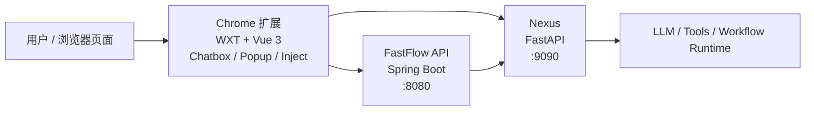

<div align="center">
  
  <h1>FastFlow</h1>
  <p>基于 Chrome Extension + Nexus + API 的 AI 工作流 Copilot</p>
  <p>
    <a href="https://github.com/EayonLee/FastFlow">
      
    </a>
    <a href="https://developer.chrome.com/docs/extensions/develop/migrate/what-is-mv3">
      
    </a>
    <a href="./chrome-extension/README.md">
      
    </a>
    <a href="./nexus/main.py">
      
    </a>
    <a href="./api/pom.xml">
      
    </a>
    
    
    
  </p>
  <p>
    <a href="https://github.com/EayonLee/FastFlow/stargazers">
      
    </a>
    <a href="https://github.com/EayonLee/FastFlow/issues">
      
    </a>
    <a href="https://github.com/EayonLee/FastFlow/commits/main">
      
    </a>
  </p>
  <p>
    <a href="#快速开始">快速开始</a>
    ·
    <a href="#通过-github-releases-安装-chrome-扩展">安装插件</a>
    ·
    <a href="./chrome-extension/README.md">扩展文档</a>
    ·
    <a href="https://github.com/EayonLee/FastFlow">GitHub 仓库</a>
  </p>
</div>

## 项目简介

FastFlow 是一个围绕工作流理解、问答辅助和智能体执行链路构建的全栈项目。它由三部分组成：

- `chrome-extension/`：基于 WXT + Vue 3 的 Chrome 扩展，负责在页面中提供聊天框、Popup、工作流导入导出与注入桥。
- `api/`：基于 Spring Boot 3 的业务 API，负责账户、鉴权、配置与服务编排入口。
- `nexus/`：基于 FastAPI 的智能体执行层，负责模型调用、工具调度、流式事件输出与工作流上下文处理。

如果你只关心浏览器扩展开发，可以直接阅读 [chrome-extension/README.md](./chrome-extension/README.md)。  
如果你要跑通整套链路，根 README 是首选入口。

## 通过 GitHub Releases 安装 Chrome 扩展

如果你只是想使用插件，而不是参与开发，推荐直接通过发行版安装，不需要本地启动 `api/` 和 `nexus/`。

发行版入口：

- 仓库右侧 `Releases`
- 直接访问：[FastFlow Releases](https://github.com/EayonLee/FastFlow/releases)

安装步骤：

1. 打开 [FastFlow Releases](https://github.com/EayonLee/FastFlow/releases)
2. 下载最新版本中的扩展发行包，文件名类似 `fastflow-<version>-chrome.zip`
3. 把 zip 解压到一个本地目录，例如 `~/Downloads/fastflow-1.0.0-chrome/`
4. 打开 Chrome，访问 `chrome://extensions`
5. 打开右上角“开发者模式”
6. 点击“加载已解压的扩展程序”
7. 选择刚才解压后的目录，而不是 zip 文件本身

注意：

- Chrome 这里加载的是“解压后的目录”，不是直接导入 zip
- 如果你升级到新版本，重新下载新的 release 并解压后，在扩展页点击刷新，或重新加载新目录即可
- 发行版安装的详细说明也写在 [chrome-extension/README.md](./chrome-extension/README.md) 中

## 核心能力

- 页面内嵌聊天框：在目标页面内直接发起工作流问答，而不是跳转到独立后台页面。
- 工作流感知问答：聊天请求会携带当前工作流图和工作流元信息，Nexus 可以基于上下文生成回答。
- 流式事件消费：扩展通过后台 service worker 代理 SSE，避免页面侧直接访问后端带来的 CORS、Mixed Content 和上下文隔离问题。
- 开发 / 生产双渠道构建：Chrome 扩展支持独立的 `development` / `production` 产物与固定扩展 ID 策略。
- 清晰的三段式架构：扩展负责交互，API 负责业务入口，Nexus 负责智能体与模型执行。

## 架构总览



补充说明：

- `chrome-extension` 通过 background service worker 统一访问 `API` 和 `Nexus`。
- `Nexus` 负责流式输出 `answer.delta`、`thinking.delta`、`run.completed` 等事件。
- `API` 默认运行在 `8080`，`Nexus` 默认运行在 `9090`。

## 仓库结构

| 目录 | 说明 |
| --- | --- |
| [`chrome-extension/`](./chrome-extension/README.md) | Chrome MV3 扩展。包含页面内聊天框、Popup、内容脚本、页面注入桥与构建配置。 |
| [`api/`](./api/README.md) | Spring Boot 业务 API。默认端口 `8080`，并可代理或编排对 Nexus 的访问。 |
| [`nexus/`](./nexus/README.md) | FastAPI 智能体层。默认端口 `9090`，负责 LLM、工具链、流式执行与事件输出。 |

## 快速开始

### 1. 环境要求

- Node.js 与 npm
- Python 3.10+
- Java 17
- Maven

建议优先使用较新的 Node.js LTS 版本。

### 2. 启动 Nexus

在仓库根目录执行：

```bash
python3 -m venv .venv
source .venv/bin/activate
pip install -r nexus/requirements.txt
python -m nexus.main
```

默认监听端口：`9090`

如需调整 Nexus 配置，优先查看：

- [`nexus/.env`](./nexus/.env)
- [`nexus/main.py`](./nexus/main.py)

### 3. 启动 API

```bash
cd api
mvn spring-boot:run
```

默认监听端口：`8080`

配置入口：

- [`api/src/main/resources/application.yml`](./api/src/main/resources/application.yml)

### 4. 构建并加载 Chrome 扩展（开发方式）

```bash
cd chrome-extension
npm install
npm run build:dev
```

构建完成后，在 Chrome 中加载：

1. 打开 `chrome://extensions`
2. 打开右上角“开发者模式”
3. 点击“加载已解压的扩展程序”
4. 选择目录 `chrome-extension/dist/development`

如果你要持续联调，可以使用：

```bash
cd chrome-extension
npm run watch
```

如果你要构建正式版：

```bash
cd chrome-extension
npm run build:prod
```

## Chrome 扩展开发与加载

当前扩展子项目已经迁移到 `WXT + Vue 3`，并统一了开发 / 生产双渠道构建。

常用命令：

```bash
cd chrome-extension

npm run watch       # development 渠道联调
npm run build:dev   # 构建开发版未打包扩展
npm run build:prod  # 构建正式版未打包扩展
npm run zip:prod    # 生成正式版 zip
npm run typecheck   # 类型检查
npm run clean       # 清理 dist 与 WXT 缓存
```

几个关键事实：

- `development` 与 `production` 使用不同渠道配置和不同扩展 ID。
- 开发环境地址只允许通过 `chrome-extension/.env.development.local` 覆盖。
- 正式环境地址和扩展公钥由扩展内部配置统一管理。

完整扩展说明见：

- [chrome-extension/README.md](./chrome-extension/README.md)

## 子模块说明

### Chrome 扩展

- 技术栈：WXT、Vue 3、Chrome MV3
- 关注点：页面聊天框、Popup、content script、inject script、background 网络代理
- 文档入口：[chrome-extension/README.md](./chrome-extension/README.md)

### API

- 技术栈：Spring Boot 3、MyBatis Plus、PostgreSQL
- 关注点：业务接口、鉴权、配置、Nexus 编排入口
- 配置入口：[application.yml](./api/src/main/resources/application.yml)
- 文档入口：[api/README.md](./api/README.md)

### Nexus

- 技术栈：FastAPI、LangChain、LangGraph、LiteLLM
- 关注点：智能体执行、工具调用、SSE 流式事件、工作流上下文
- 运行入口：[main.py](./nexus/main.py)
- 文档入口：[nexus/README.md](./nexus/README.md)

## 贡献方式

欢迎通过 Issue 或 Pull Request 参与改进：

- 提交问题：[Issues](https://github.com/EayonLee/FastFlow/issues)
- 提交代码：[Pull Requests](https://github.com/EayonLee/FastFlow/pulls)

建议在提交前至少完成：

```bash
cd chrome-extension
npm run typecheck
```
